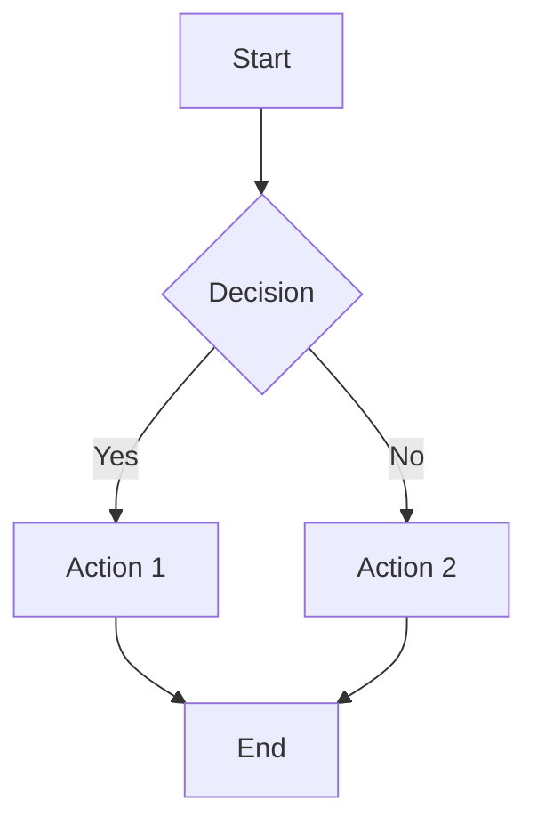
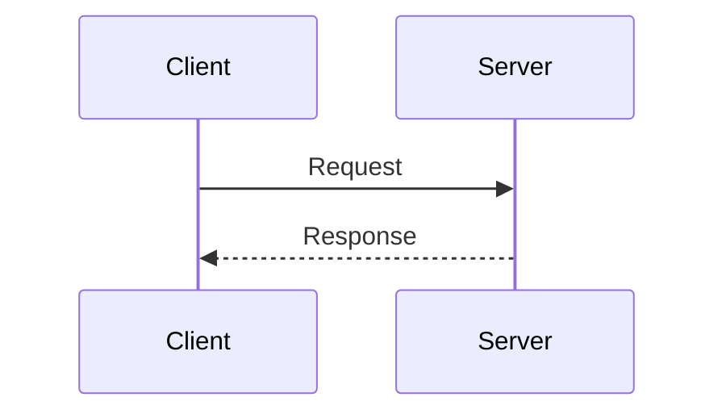
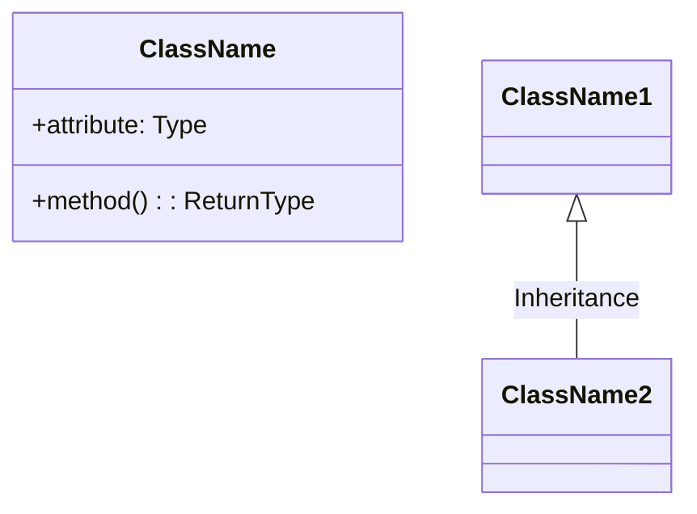
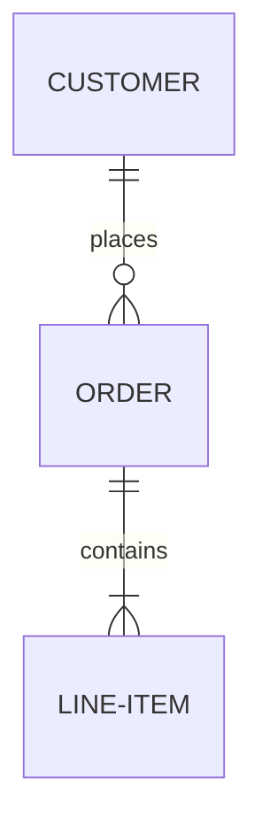
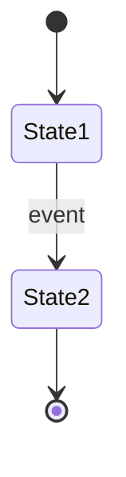

# Diagram Generator

**Purpose:** Create clear, structured diagrams using Mermaid syntax.

---

## Diagram Types

### 1. Flowchart


### 2. Sequence Diagram


### 3. Class Diagram


### 4. Entity Relationship


### 5. State Diagram


---

## Usage Guidelines

| Concept Type      | Recommended Diagram |
| ----------------- | ------------------- |
| Process/Algorithm | Flowchart           |
| Communication     | Sequence            |
| OOP Structure     | Class Diagram       |
| Database Schema   | ER Diagram          |
| State Machine     | State Diagram       |
| Timeline          | Gantt               |
| Hierarchy         | Mindmap             |

---

## Syntax Rules

- Node text with special chars: Use quotes `["Text (with parens)"]`
- Avoid HTML in labels
- Use descriptive node IDs
- Keep labels concise
- Use subgraphs for grouping

---

## Output Format

```
## [Concept Name] Diagram

[Brief description of what the diagram shows]

```mermaid
[diagram code]
```

**Key Points:**
- [Interpretation point 1]
- [Interpretation point 2]
```
